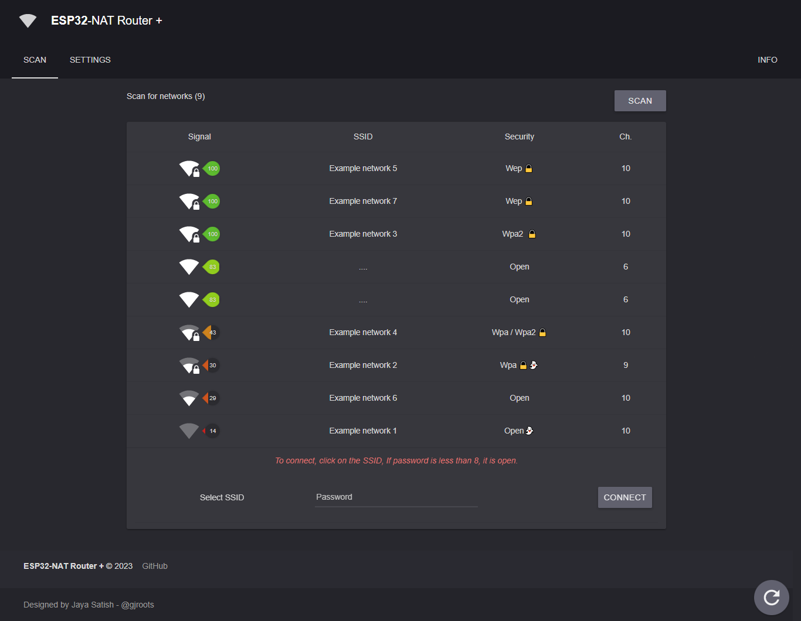
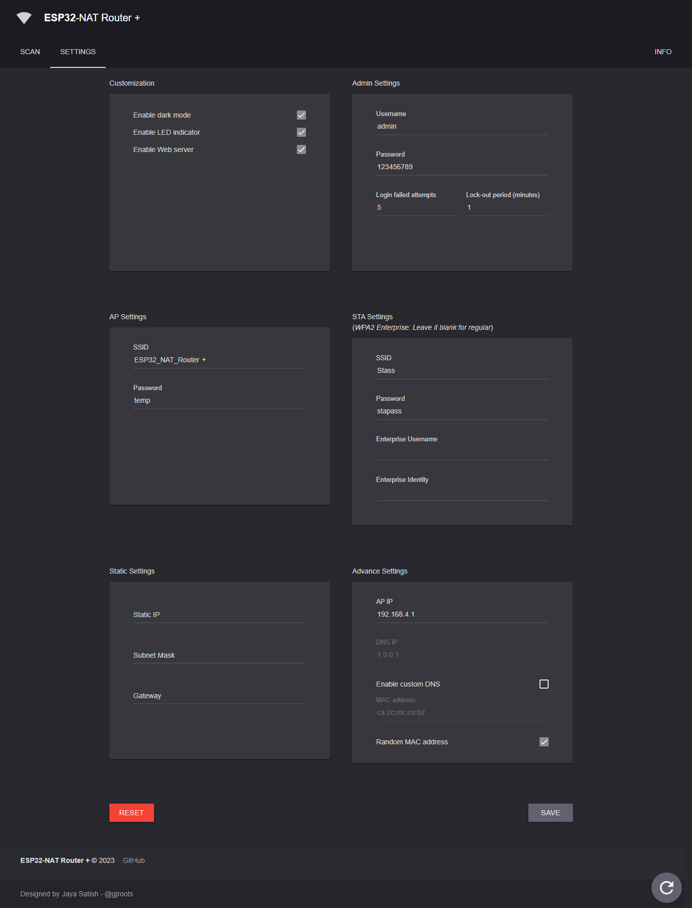
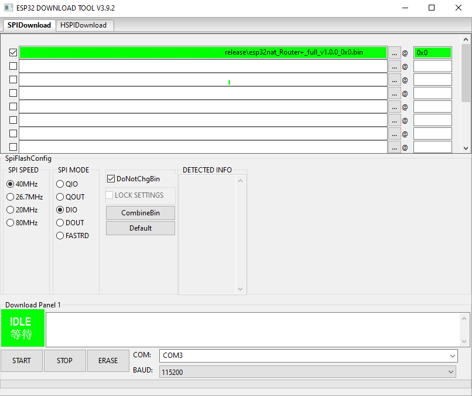
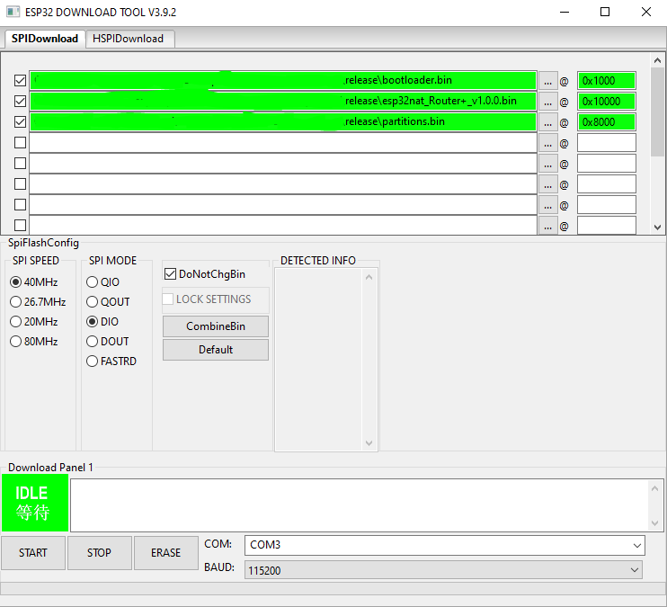

# ESP32-NAT Router +

## Acknowledgments

This project builds upon the works of *Martin-Ger's* [ESP32 NAT Router](https://github.com/martin-ger/esp32_nat_router) and *Sam Denty's* [Wi-PWN](https://github.com/samdenty/Wi-PWN) for the UI design. However, other sources have also provided inspiration and contributed to the development of this project, including:

- [@Kevin Wolfe](https://gitlab.com/kevinwolfe) (who provided OTA and other useful resources)
- [@nopnop2002](https://github.com/nopnop2002) (Cjson Doc and Examples)
- [@dchristl](https://github.com/dchristl) (whose work and ideas)

## Features

The features of the project, which includes:

- Providing a user-friendly UI with mobile support for easy accessibility
- Displaying connected states and quality in the UI for transparency
- Scanning for available APs to enhance network connectivity
- Allowing users to disable or enable the on-board indicator LED
- Incorporating a button menu (accessible via Boot or EN button)
- Custom DNS server for personalized settings
- Incorporating a secure web interface with basic authentication method
- Offering OTA updates for easy maintenance and functionality enhancements
- Randomize MAC address
- Switch Between Dark and Light mode. (through settings)
- Auto reload pages when connected to Router
- and many more...........

## First Boot

Upon the first boot of the ESP32 NAT Router, a WiFi network with an open AP and an ssid of "ESP32_NAT_Router +" will be available. Users can configure the device using either a simple web interface or the serial console.

## Web Config Interface

The ESP32 NAT Router has a web interface that allows you to configure all its parameters. To access this interface, connect your PC or smartphone to the WiFi SSID "ESP32_NAT_Router+". Once you're connected, open your web browser and enter

"[http://192.168.4.1](http://192.168.4.1/)''  into the address bar of your browser. Once you have entered this, you will be prompted for a username and password. The default `username is "admin" `and the default` password is "123456789"`. Please note that it is recommended to change these to a more secure username and password once you have logged in:

<!--  -->

To configure the uplink WiFi network, follow these steps: 

1. Go to "Settings" in the web interface of the ESP32 NAT Router 
2. Enter the appropriate values for the "STA Settings" section. If it is an open network, leave the password field blank 
3. Change the "AP Settings" and other customizations as necessary 
4. Click on the "Save" button to save the configuration 
5. Press the "Reboot" button located at the bottom right corner of the page (Nessory)
6. Wait for the device to reboot

Connect to the newly configured WiFi network with the updated settings. 
By following these steps, you can reconfigure the ESP32 NAT Router to connect to a new uplink WiFi network with customized settings based on your preferences.

**Note:** The 5th step is necessary to update certain settings on the device and apply them. Skipping this step may result in the settings not being properly applied, which can lead to issues with the device's functionality. Therefore, it is recommended to always complete the 5th step when making any changes to the device's settings in order to ensure that the device is functioning as expected and that any desired changes have been properly applied.

<!-- 


 -->

## Flashing the prebuild binaries

- Download [latest release](https://github.com/gjroots/esp32_nats_router_plus/releases/latest)
  * Download esp32nat_Router+_vX.X.X.zip for fresh install
  * Download esp32nat_Router+_full_vX.X.X_0x0.zip for update
- Install [esptool](https://github.com/espressif/esptool)

### First install/ Reset (Terminal/CMD)

Please note that if your device was previously used for other projects, or if you want to reset all settings from a previous version, executing the following steps will result in complete data loss.

Note: replace X.X.X with respective Version.(eg. ...._v1.0.0.bin)

Unpack archive first and then execute:

Single bin method (merged, 0x0): 

```
esptool.py write_flash 0x0 esp32nat_Router+_full_vX.X.X_0x0.bin 
```

Multi bin method:

```
esptool.py --chip esp32 \
--before default_reset --after hard_reset write_flash \
-z --flash_mode dio --flash_freq 40m --flash_size detect \
0x1000 bootloader.bin \
0x8000 partitions.bin \
0x10000 esp32nat_Router+_vX.X.X.bin
```

### Update from older version

If this project was already installed. No data loss from previous version. 

```
esptool.py write_flash 0x10000 esp32nat_Router+_vX.X.X.bin 
```

If any problem occurs, erase flash manually before flashing:

```
esptool.py erase_flash
```

### OTA method :

To perform an OTA update on the ESP32-NATS Router+, follow these steps:

1. Go to the "Info" page in the web interface of the router
2. Click on the "Update" button
3. Select the desired bin file for the update

Please note that the OTA method only supports updating with a single bin file, such as "esp32nat_Router+_vX.X.X.bin". Updating with a full bin (merged to single bin 0x0) is not supported.

### Alternative way/ Graphical (Windows only)

As an alternative you might use [Espressif's Flash Download Tools](https://www.espressif.com/en/support/download/other-tools).
Check the marked parameters and files like below (ckeck the COM-Port for your environment). 
Check the addresses like below: 



### or



## Building the Binaries

To build the binaries, please refer to the following guide: "[How to setup environment and build project](docs/Build_setup.md)" located in the "docs" folder. This guide outlines the necessary steps to set up the environment and build the binaries.

## Advanced topics and configuration

For more advanced configuration and topics, refer to the "[Advanced topics](docs/Advanced_topics.md)" guide located in the "docs" folder. This guide covers topics such as configuring wireless protocols, setting up custom DNS servers working with OTA and other settings.

## Misc

If you experience any issues or have any suggestions for new features, please feel free to ask or raise an issue. Please note that as this project is a spare time project, the creator may not be always available to answer queries promptly. However, if the creator is free, they will respond as soon as possible. Thank you for your understanding and patience. 

If you are happy with the project and would like to support the creator, there are several ways to do so. One way is to contribute to the codebase or documentation. Alternatively, you can support the creator through by spreading the word about the project to others who may find it useful.

## License

The software is released under the MIT License, which can be found in the file named "[LICENSE](LICENSE)". Additionally, any third-party source files included in the software will have their own license header.

## Screenshots

[](docs/images/scan.png)

[](docs/images/settings.png)

[](docs/images/info.png)
